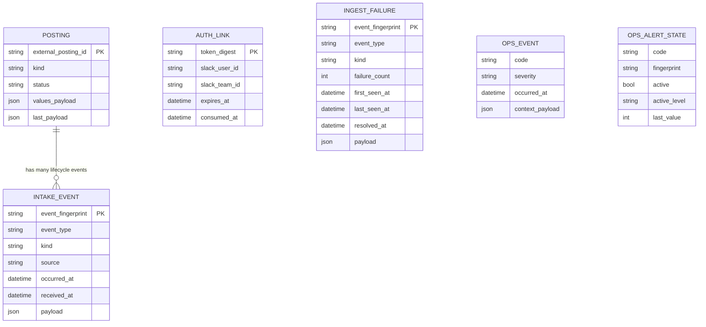

# Domain Model and Data Shape

Date: 2026-02-21
Status: Living reference

## Purpose

Provide one canonical reference for the data model and payload shapes used across:

- `slack-app` event production
- `jobs-api` ingestion and persistence
- `jobs-api` read endpoints

This document describes the current implementation (not the original draft contracts).

## Bounded Contexts

1. Intake and publishing (`slack-app`)
- Collects structured values from Slack modals.
- Publishes messages into RLS channels.
- Emits lifecycle events (`published`, `updated`, `archived`) to API ingest.

2. Persistence and read model (`jobs-api`)
- Validates ingest envelopes.
- Dedupe by payload fingerprint.
- Stores current projection in `postings`.
- Stores immutable history in `intake_events`.

3. Access and operations (`jobs-api`)
- One-time auth links (`auth_links`) for web session bootstrap.
- Ingest failure queue (`ingest_failures`) for replay and triage.
- Telemetry and alert state (`ops_events`, `ops_alert_states`).

## Entity Relationship View



## Canonical Enums

- `kind`: `job_posting` | `candidate_profile`
- `eventType`: `slack_post_published` | `slack_post_updated` | `slack_post_archived`
- `posting.status`: `active` | `archived`
- `posting.moderation_state`: `unreviewed` | `reviewed` | `cleared` | `escalated`
- `ops_event.severity`: `warning` | `critical`
- `ops_alert_state.active_level`: `normal` | `warning` | `critical`

Common option enums used inside `values`:

- `workArrangements`: `onsite` | `hybrid` | `remote` | `flexible`
- `employmentTypes`: `full_time` | `part_time` | `contract` | `consulting` | `cofounder`
- `availabilityModes`: `actively_interviewing` | `open_to_opportunities` | `contract_only` | `cofounder_only`
- `compensationDisclosure`: `range_provided` | `negotiable` | `not_listed` | `performance_based`
- `compensationComponents`: `equity` | `bonus` | `commission`
- `visaPolicy`: `yes` | `no` | `case_by_case` | `unknown`
- `relationship`: `hiring_manager` | `team_member` | `recruiter` | `referral` | `candidate_self` | `other`

## Ingest Envelope (`POST /api/v1/intake`)

Canonical request shape:

```json
{
  "payloadVersion": 1,
  "eventType": "slack_post_published",
  "kind": "job_posting",
  "previewId": "job_preview_001",
  "postingId": "posting_job_001",
  "permalink": "https://...",
  "route": {
    "channelFocus": "onsite_jobs",
    "channelId": "C123ONSITE",
    "channelLabel": "#onsite-jobs"
  },
  "slack": {
    "teamId": "T123",
    "previewDmChannelId": "D123",
    "previewDmMessageTs": "1739955600.100000",
    "publishedMessageTs": "1739955660.100000",
    "publishedByUserId": "U123POSTER"
  },
  "moderation": {
    "enabled": true,
    "flagged": false,
    "reason": "",
    "accountAgeDays": 225,
    "thresholdDays": 14
  },
  "values": {
    "posterUserId": "U123POSTER"
  },
  "postedAt": "2026-02-19T09:00:00Z"
}
```

Validation at API boundary:

- Required top-level: `eventType`, `kind`, `values` (object), `route` (object), `slack` (object)
- Required nested:
  - `route.channelId`
  - `route.channelFocus`
  - `slack.teamId`
  - `slack.publishedByUserId`
  - `values.posterUserId`
- Identity requirement: at least one of `postingId` or `previewId`
- If provided, `payloadVersion` must be a positive integer

Machine-readable schema:

- `docs/schemas/intake-event.schema.json`

## `values` Shape by Kind

`values` is intentionally extensible. The API only enforces `posterUserId`, while Slack modal validation enforces a richer contract before publish/edit.

### `job_posting` values

UI-required keys:

- `companyName` (string)
- `roleTitle` (string)
- `locationSummary` (string)
- `workArrangements` (string[])
- `employmentTypes` (string[])
- `compensationValue` (string)
- `visaPolicy` (string enum)
- `relationship` (string enum)
- `posterUserId` (string)

Optional keys:

- `compensationComponents` (string[])
- `links` (string; newline or comma-delimited URLs)
- `skills` (string)
- `summary` (string)
- `allowThreadQuestions` (boolean)

### `candidate_profile` values

UI-required keys:

- `headline` (string)
- `locationSummary` (string)
- `workArrangements` (string[])
- `availabilityModes` (string[])
- `engagementTypes` (string[])
- `compensationDisclosure` (string enum)
- `compensationValue` (string)
- `visaPolicy` (string enum)
- `relationship` (string enum)
- `posterUserId` (string)

Optional keys:

- `compensationComponents` (string[])
- `links` (string; newline or comma-delimited URLs)
- `skills` (string)
- `notes` (string)
- `allowThreadQuestions` (boolean)

## Persistence Model

### `postings` (current projection)

Identity and lifecycle:

- `external_posting_id` unique, canonical posting ID
- `kind`, `status`, `posted_at`, `archived_at`, `archived_by_user_id`

Slack provenance:

- `team_id`, `channel_id`, `channel_focus`, `channel_label`
- `preview_id`, `preview_dm_channel_id`, `preview_dm_message_ts`
- `published_message_ts`, `published_by_user_id`, `permalink`

Search and browse projection:

- `company_name`, `role_title`, `headline`, `location_summary`
- `compensation_value`, `visa_policy`, `relationship`, `skills`, `summary`
- `search_text` (denormalized for text filtering)

Moderation:

- `moderation_flagged`, `moderation_state`, `moderation_reason`
- `account_age_days`, `moderation_last_reviewed_at`, `moderation_reviewed_by`

Payload snapshots:

- `values_payload` (JSON string of current `values`)
- `last_payload` (JSON string of latest full event envelope)

### `intake_events` (immutable event log)

- One row per accepted lifecycle event
- Deduplication key: `event_fingerprint` (unique SHA-256 over canonicalized payload)
- Links to posting via `posting_id` and `external_posting_id`
- Stores full request in `payload` and normalized metadata (`event_type`, `kind`, `received_at`, `occurred_at`, etc.)

### `auth_links`

- Stores one-time digest token (`token_digest`, never raw token)
- Tracks issuer identity (`slack_user_id`, `slack_team_id`, optional name)
- Expiry and single-use tracking (`expires_at`, `consumed_at`, `consumed_ip`)

### `ingest_failures`

- One row per unresolved fingerprint, with rolling counters:
  - `failure_count`, `first_seen_at`, `last_seen_at`
- Stores last failed payload and reason
- Replay/resolve markers: `replayed_at`, `resolved_at`

### `ops_events` and `ops_alert_states`

- `ops_events`: append-only telemetry events with code/severity/context
- `ops_alert_states`: mutable threshold state machine per `(code, fingerprint)`

## Read API Shapes

### `GET /api/v1/postings`

Response:

- `ok` (boolean)
- `postings` (array of posting summaries)
- `count` (integer)

Each posting summary includes:

- `external_posting_id`, `kind`, `status`
- `poster_user_id`, `team_id`, `channel_id`, `channel_focus`, `channel_label`
- `published_message_ts`, `permalink`
- `created_at`, `updated_at`, `archived_at`
- `values` (object)
- `moderation` object:
  - `flagged`, `state`, `reason`, `account_age_days`, `last_reviewed_at`, `reviewed_by`

Machine-readable schema:

- `docs/schemas/posting-api.schema.json`

### `GET /api/v1/postings/:external_posting_id`

Response:

- `ok` (boolean)
- `posting` (same shape as an item from list endpoint)

### `POST /api/v1/auth_links`

Response:

- `ok` (boolean)
- `auth_url` (single-use URL)
- `expires_at` (ISO 8601)
- `ttl_seconds` (integer)

### `GET /api/v1/ops/summary`

Response:

- `ok` (boolean)
- `summary` object with keys:
  - `generated_at`
  - `operation_mode`
  - `unresolved_ingest_failures`
  - `replayed_failures_24h`
  - `intake_volume_24h`
  - `duplicate_ingest_count_24h`
  - `duplicate_ingest_rate_24h`
  - `moderation_flagged_active`
  - `moderation_escalated`
  - `auth_link_issuance_24h`
  - `auth_link_failures_24h`
  - `intake_validation_failures_24h`
  - `retention_cleanup_preview_90d`

## Session Shape (Web UI, server session store)

Session keys set after auth redemption:

- `rls_authenticated` (boolean)
- `rls_slack_user_id` (string)
- `rls_slack_team_id` (string)
- `rls_started_at` (ISO 8601)
- `rls_last_seen_at` (ISO 8601)
- `rls_hard_expires_at` (ISO 8601, max 1 hour from login)
- `rls_idle_expires_at` (ISO 8601, rolling up to hard expiry)

## Notes

- The source of truth for persisted columns remains `jobs-api/db/schema.rb`.
- Older draft contracts in `jobs-api/docs/stage-0-ingestion-contract.md` are historical and do not reflect the current implemented envelope.
- If new keys are added to `values`, update this file and the JSON schema files in `docs/schemas/`.
